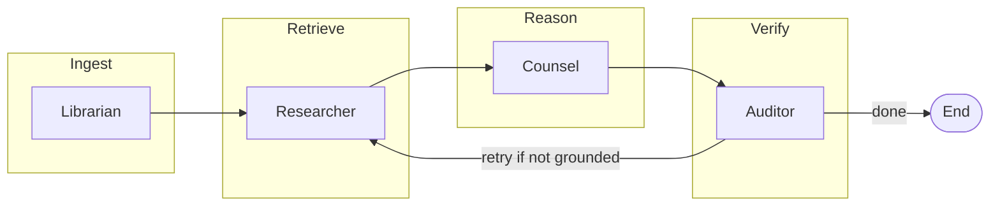

<div align="center">

<a href="https://github.com/frank-asket/legal-multi-agent-platform">
  
</a>

**Agentic contracts intelligence — multi-model retrieval, drafting, and faithfulness auditing on your documents.**

<br />

[](https://www.python.org/downloads/)
[](https://fastapi.tiangolo.com/)
[](https://langchain-ai.github.io/langgraph/)
[](https://docs.pydantic.dev/)
[](https://openrouter.ai/)

[](https://github.com/frank-asket/legal-multi-agent-platform/actions/workflows/ci.yml)
[](./Dockerfile)
[](./pyproject.toml)

<br />

[Features](#-what-you-get) · [Architecture](#-architecture) · [Quick start](#-quick-start) · [API](#-http--websocket-api) · [Production](#-production-hardening) · [Repo map](#-repository-map)

</div>

---

## What you get

| | Capability |
|---|-------------|
| **Agents** | Sequential **Librarian → Researcher → Counsel → Auditor** flow with conditional **retry** back to retrieval when grounding fails. |
| **Models** | Optional **OpenRouter** with **different model IDs** per role (researcher / counsel / auditor); offline stubs when no API key. |
| **Grounding** | Counsel answers constrained to retrieved chunks; auditor checks faithfulness and suggests **retrieval refinements**. |
| **Delivery** | **REST** for synchronous runs and **WebSocket** streaming (`updates` + final `values`) in one graph execution. |
| **Operations** | Typed **settings**, request IDs, optional **API keys**, **rate limits**, CORS / trusted hosts, **Docker** + **GitHub Actions** CI. |

---

## Architecture

Agents share a single **`LegalGraphState`** (chunks, ranked passages, analyst answer, auditor verdict, playbook flags, status log). The auditor can route back to the researcher until retries are exhausted.



---

## Quick start

```bash
git clone https://github.com/frank-asket/legal-multi-agent-platform.git
cd legal-multi-agent-platform
python3.11 -m venv .venv
source .venv/bin/activate   # Windows: .venv\Scripts\activate
pip install -e ".[dev]"
cp .env.example .env
uvicorn server.main:app --reload --host 0.0.0.0 --port 8000
```

| Goal | Command / URL |
|------|----------------|
| Liveness | `GET http://127.0.0.1:8000/health` |
| Readiness | `GET http://127.0.0.1:8000/health/ready` |

Configure **OpenRouter** and per-role models in `.env` when you are ready for live LLMs (see `.env.example`).

---

## HTTP & WebSocket API

| Surface | Method / path | Purpose |
|---------|---------------|---------|
| **REST** | `POST /v1/query` | One-shot run; JSON body with `user_query`, `document_ids`, `thread_id`. |
| **Stream** | `WS /ws/session/{thread_id}` | Send JSON: `{"user_query": "...", "document_ids": ["demo-doc"]}`; receive `update` then `result`. |

**Headers (optional)**

- `X-Request-ID` — echoed on responses for tracing.
- `X-API-Key` — required when `API_KEYS` is set in the environment.

---

## Production hardening

1. **Environment** — Tighten `CORS_ALLOW_ORIGINS`, set `TRUSTED_HOSTS`, enable `API_KEYS` for service-to-service calls, and set `RATE_LIMIT_PER_MINUTE` on `/v1/query`. See `.env.example` for payload limits and OpenRouter options.
2. **Edge** — Terminate TLS at your reverse proxy; the bundled **Dockerfile** runs Uvicorn with `--proxy-headers --forwarded-allow-ips` for forwarded client metadata.
3. **Ship** — `docker compose up --build` uses `docker-compose.yml` and reads `.env`.

Logs include path, status, duration, and **`request_id`**; error JSON responses include **`request_id`** where applicable.

---

## Repository map

| Path | Role |
|------|------|
| `legal_multi_agent/settings.py` | Environment and limits (Pydantic Settings). |
| `legal_multi_agent/state.py` | Shared graph state and citation types. |
| `legal_multi_agent/graph.py` | LangGraph build and auditor routing. |
| `legal_multi_agent/nodes.py` | Librarian, researcher, counsel, auditor implementations. |
| `legal_multi_agent/openrouter.py` | OpenRouter / OpenAI-compatible JSON completions. |
| `server/main.py` | FastAPI app, lifespan, rate limits, WebSocket session. |
| `server/middleware.py` | Request ID and access logging. |
| `server/security.py` | API key and thread / payload checks. |

---

## Optional: Postgres and pgvector

```bash
pip install -e ".[db]"
```

Extend hybrid retrieval in `legal_multi_agent/nodes.py` (`researcher_node`).

---

## Tests and CI

```bash
pytest
```

CI runs on **Python 3.11** and **3.12** (see `.github/workflows/ci.yml`). Unit tests pin `OPENROUTER_API_KEY` empty so runs stay **offline and deterministic**.

---

<div align="center">

**Built for teams that need traceable, multi-step legal Q&A — not a black-box chatbot.**

<sub>Typing animation via <a href="https://github.com/DenverCoder1/readme-typing-svg">readme-typing-svg</a> · Badges via <a href="https://shields.io">Shields.io</a></sub>

</div>
